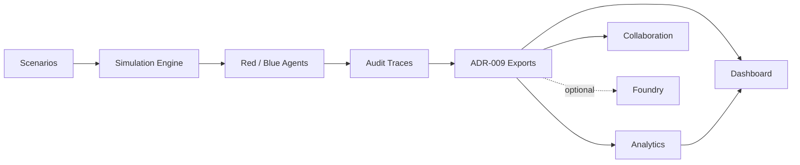

# ADSL — Aether Defense Simulation Layer

**Audit-first contested-logistics simulation for defense analysis, workshops, and Palantir-ready outputs.**

[](#quality)
[](#quality)
[](#limitations)

ADSL models **Red (adversary)** and **Blue (defender)** decision-making over contested supply networks. Every agent decision produces an **immutable audit trace** with reasoning steps — suitable for defense review, analyst workflows, workshops, and optional Ontology ingestion.

ADSL is a **bounded simulation layer**, not a general wargame or agent framework. It trades breadth for auditability, explainable analytics, and workshop usability.

## License

This project is licensed under the [MIT License](LICENSE).

Copyright © 2026 Apostolos Kalogritsas. All rights reserved.

---

## New here? (~7 minutes)

| Step | Document | Time |
|------|----------|------|
| 1 | [What is ADSL?](docs/what-is-adsl.md) | 2 min |
| 2 | [Getting Started](docs/getting-started.md) | 3 min |
| 3 | [Capabilities & Limitations](docs/capabilities-and-limitations.md) or [Positioning](docs/positioning.md) | 2 min |

Full index: [docs/README.md](docs/README.md)

---

## Why ADSL

| Strength | What it means |
|----------|---------------|
| **Audit-first** | Every decision → `ADSL_AuditTrace` with reasoning steps (ADR-003) |
| **Deterministic** | Seeded runs, golden traces, auditable deconfliction (ADR-008) |
| **Workshop-ready** | Export bundles, demo playbook, dashboard, collaboration sessions |
| **Explainable analytics** | Risk scores, bottlenecks, Red patterns, what-if — traceable to raw data |
| **Performance at scale** | Mega-scale scenarios (36 agents, 37 nodes); ~2.8× engine speedup (Inc 16) |
| **Modular** | Engine standalone; viz, analytics, Foundry, collaboration are optional layers |
| **Palantir path** | Six Ontology types; optional Foundry dataset import/export (local mode default) |

---

## Quick Start

```bash
pip install -e ".[dev]"
python -m pytest -q                    # verify: 138 passed

python scripts/run_simulation.py --scenario island-chokepoint-v2 --ticks 100 --quiet-logs
python scripts/export_run.py --scenario island-chokepoint-v2 --ticks 100 --export-dir exports --quiet-logs
python scripts/launch_dashboard.py --export-dir exports
```

Extended examples (analytics, comparison, collaboration, benchmarks): [docs/getting-started.md](docs/getting-started.md)

---

## Capabilities

| Area | What works today |
|------|------------------|
| **Simulation** | 5 scenarios; ≤100 ticks default (500 in scale mode); Red/Blue agents; pacing, hardening, deconfliction |
| **Explainability** | 100% audit trace coverage; reasoning steps; `ACTION_SUPPRESSED` events |
| **Exports** | ADR-009 bundles — JSON, traces, executive summary, insights, annotations |
| **Analytics** | Node/route/corridor risk, focus areas, what-if (`adsl-analyze`, `adsl-compare`) |
| **Visualization** | Dashboard — risk overlay, run comparison API, presentation mode |
| **Collaboration** | File-based sessions, scenario sharing, run annotations (ADR-013) |
| **Foundry** | Optional dataset import/export with lineage; **local mode by default** |
| **Performance** | Observation cache (Inc 16), parallel batch export, benchmarks (`--engine-only`) |

Details: [docs/capabilities-and-limitations.md](docs/capabilities-and-limitations.md) · [docs/capabilities-matrix.md](docs/capabilities-matrix.md)

---

## Limitations

| Limitation | Status |
|------------|--------|
| Live Palantir / Foundry sync | **Optional** — requires credentials; local mode is default |
| Doctrine, physics, theater-scale | **Out of scope** unless opened via ADR |
| Real-time simulation streaming | Batch-at-run-end only |
| Operational / classified data | Synthetic scenarios only |
| Real-time collaborative editing | File-based collaboration only |
| Within-tick parallel agents | Sequential turns required for deconfliction |

**No data is written to a live Foundry instance unless you explicitly enable credentials and export.**

Project status: [docs/status.md](docs/status.md)

---

## Architecture



The simulation engine has **zero** Palantir SDK imports. Platform integration is optional and isolated in `ontology/` and `foundry/`.

Full architecture: [docs/architecture-overview.md](docs/architecture-overview.md)

---

## Documentation

| Document | Audience | Time |
|----------|----------|------|
| [what-is-adsl.md](docs/what-is-adsl.md) | Everyone | 2 min |
| [getting-started.md](docs/getting-started.md) | New users | 5 min |
| [positioning.md](docs/positioning.md) | Evaluators | 3 min |
| [capabilities-and-limitations.md](docs/capabilities-and-limitations.md) | Analysts, PMs | 4 min |
| [capabilities-matrix.md](docs/capabilities-matrix.md) | Reference | — |
| [architecture-overview.md](docs/architecture-overview.md) | Engineers | 5 min |
| [scale-performance.md](docs/scale-performance.md) | Performance tuning | 5 min |
| [docs/README.md](docs/README.md) | Full index | — |

**Feature guides:** [analytics](docs/analytics-insights.md) · [visualization](docs/visualization.md) · [collaboration](docs/collaboration-workflows.md) · [Foundry](docs/foundry-integration.md) · [workshop playbook](docs/demo-playbook.md)

---

## Quality

| Metric | Value |
|--------|-------|
| Tests | 138 passing |
| Coverage | ~89% overall |
| ADRs | ADR-001–014 |
| Scenarios | 5 in registry |

```bash
python -m pytest --cov=adsl --cov-report=term-missing
```

---

## Development

```bash
pip install -e ".[dev]"
python -m pytest -q
```

Environment template: [.env.example](.env.example)

---

## Contributing

See [CONTRIBUTING.md](CONTRIBUTING.md) for guidelines. Licensed under the [MIT License](LICENSE).