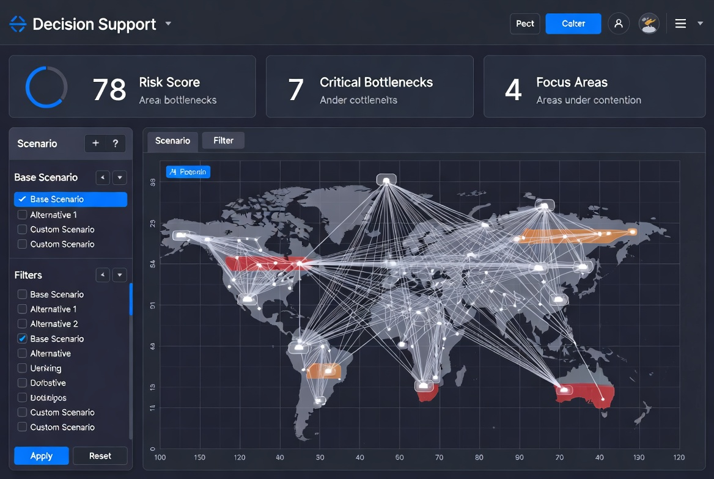
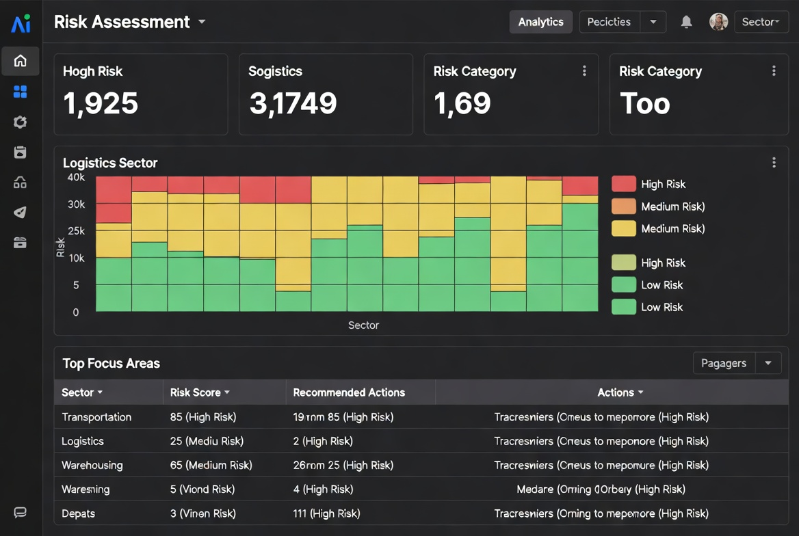
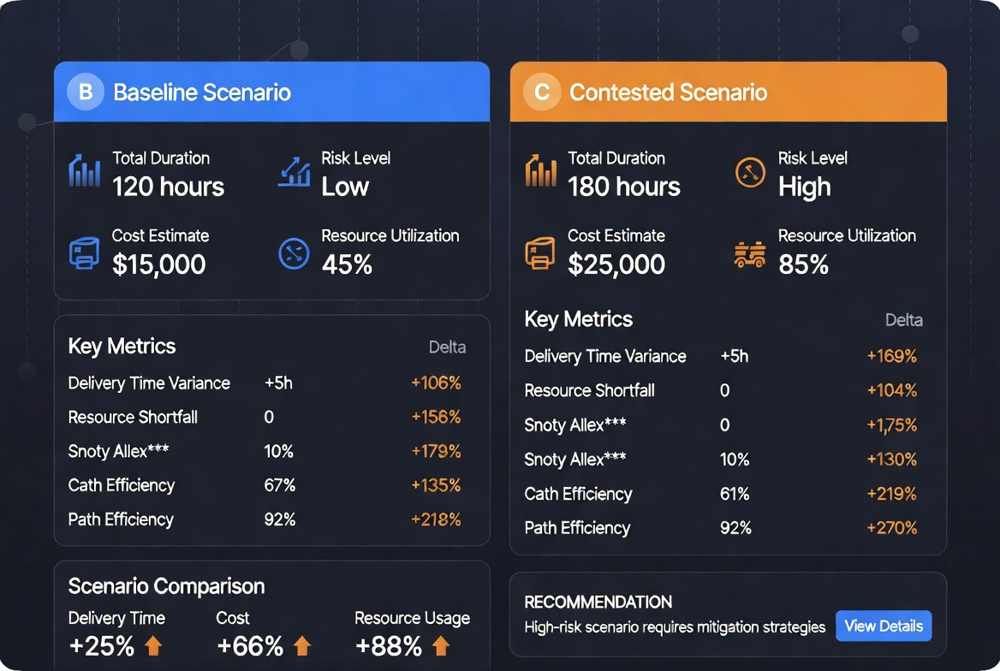

# ADSL — Self-Governing Agent Platform for Contested Logistics

**ADSL** is a defense-oriented simulation and decision support platform built on a **self-governing agent architecture**. It enables military planners, defense analysts, and critical infrastructure teams to model, stress-test, and optimize logistics operations in contested, disrupted, or denied environments.

Most logistics and agent frameworks assume stable conditions. ADSL is designed for reality.

## Core Differentiator: Self-Governing Architecture

ADSL is not just another agent framework. It incorporates a **constitutional, self-governing design** that prioritizes:

- Explainable and auditable decisions
- Controlled agent behavior under uncertainty
- Long-term reliability without constant human oversight
- Alignment with high-stakes operational requirements

This makes ADSL particularly suited for defense and national security applications where trust, traceability, and resilience are non-negotiable.

## Why ADSL?

| Aspect                           | Traditional Logistics Tools | General AI Agent Frameworks | **ADSL**                                              |
|----------------------------------|-----------------------------|-----------------------------|-------------------------------------------------------|
| **Primary Environment**          | Stable operations           | General purpose             | **Contested, disrupted, and denied environments**     |
| **Decision Governance**          | Minimal                     | Limited                     | **Self-governing + constitutional principles**        |
| **Explainability**               | Weak                        | Variable                    | **Strong decision traceability by design**            |
| **Simulation Fidelity**          | Basic                       | Variable                    | **High-fidelity contested logistics modeling**        |
| **Analytics Depth**              | Limited                     | Basic                       | **Risk scoring, bottleneck detection, scenario analysis** |
| **Defense / High-Stakes Ready**  | Moderate                    | Low                         | **Purpose-built for defense and critical operations** |

## Quick Demo

Experience the current capabilities:

```bash
git clone https://github.com/SpicyFeta/adsl.git
cd adsl
pip install streamlit pandas
streamlit run demo/streamlit_demo.py
```

## Visual Overview

### Decision Support Dashboard


### Risk Assessment & Focus Areas


### Scenario Comparison


## Key Features

- **Contested Logistics Simulation** — Model blue force logistics against red adversarial actions
- **Self-Governing Agent Architecture** — Agents operate under constitutional constraints with built-in explainability
- **Advanced Analytics Engine** — Automatic risk scoring, bottleneck identification, and focus area detection
- **Scenario Comparison & Decision Support** — Rapid evaluation of courses of action under different conditions
- **Defense-Oriented Design** — Traceable decisions suitable for operational planning and Palantir Foundry workflows

## Use Cases

- Military logistics planning in contested theaters
- Coalition and joint force sustainment analysis
- Critical infrastructure resilience under disruption
- Wargaming and course-of-action development
- Defense analytics and operational research

## Project Status

ADSL is under active development with a focus on rapid iteration.

**Current priorities (Next 5–7 days):**
- Polish demo experience
- Strengthen self-governing agent capabilities
- Improve analytics depth and visualization
- Enhance defense-oriented documentation and positioning

## Getting Started

```bash
git clone https://github.com/SpicyFeta/adsl.git
cd adsl
pip install -r requirements.txt
```

## Contributing

Contributions from defense technologists, simulation experts, and AI researchers are welcome.

## License

MIT License

---

**Built for contested environments where decisions must be trustworthy.**