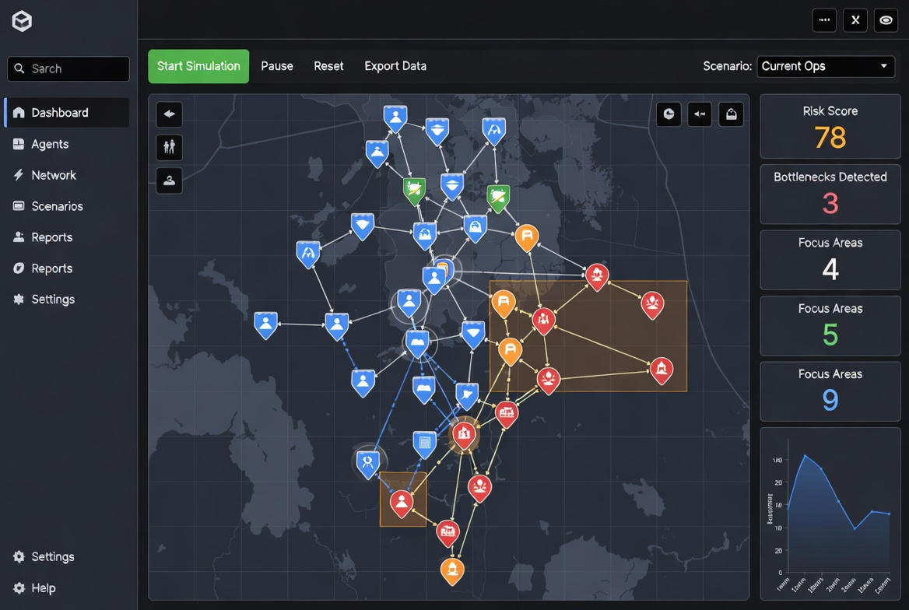
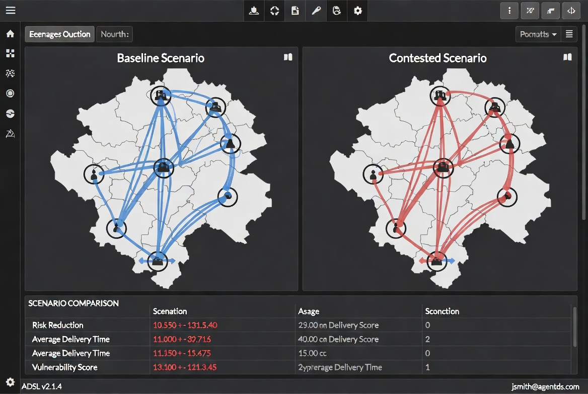

# ADSL — Agent-based Decision Support for Logistics

**ADSL** is a powerful agent-based simulation and analytics platform built for **contested logistics** environments. It enables organizations to model, analyze, and stress-test supply chains and logistics operations under disruption, adversarial conditions, and high-risk scenarios.

## Why ADSL?

Most logistics tools assume stable conditions. ADSL is designed for reality — where routes can be contested, decisions must be made under pressure, and risk is dynamic.

### Key Features

- **Agent-Based Simulation** — Blue logistics agents and Red adversarial agents interact in complex networks.
- **Contested Environment Modeling** — Simulate bottlenecks, disruptions, and adaptive rerouting.
- **Advanced Analytics Engine** — Automatic risk scoring, bottleneck detection, and focus area identification.
- **Scenario Comparison** — Run and compare multiple scenarios side-by-side with clear metrics.
- **Decision Traceability** — Every agent decision is explainable and auditable.
- **Self-Governing Architecture** — Built with a constitutional self-improvement system.

## Visual Overview

### Main Dashboard & Live Map


### Analytics Dashboard


### Scenario Comparison


## Getting Started

### Requirements
- Python 3.10+
- Git

### Installation

```bash
git clone https://github.com/SpicyFeta/adsl.git
cd adsl
pip install -r requirements.txt
```

### Quick Start

```bash
python examples/basic_simulation.py
```

> **Note:** A full interactive web demo is currently in development.

## Use Cases

- Military and defense logistics planning
- Supply chain resilience and risk analysis
- Critical infrastructure protection
- Wargaming and scenario planning
- Research in complex adaptive systems

## Project Status

ADSL is under active development. The simulation engine and analytics modules are mature. A user-friendly interface and interactive demo are in progress.

## Contributing

Contributions are welcome. Please read [CONTRIBUTING.md](CONTRIBUTING.md).

## License

Licensed under the MIT License. See [LICENSE](LICENSE) for details.

Copyright © 2026 Apostolos Kalogritsas (SpicyFeta)