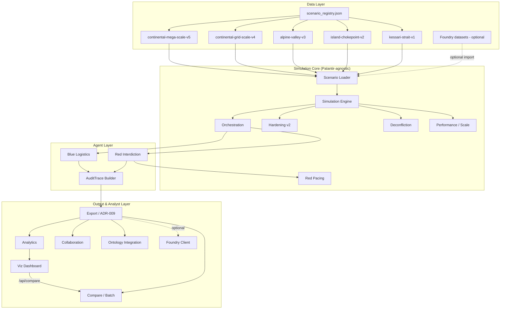
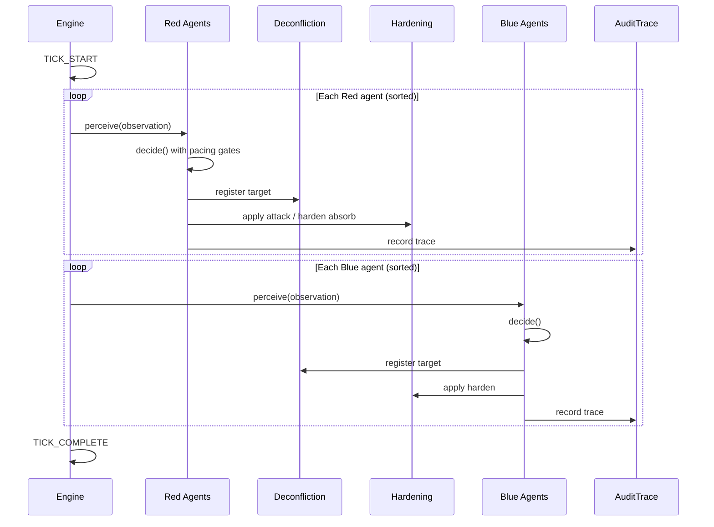

# ADSL — Architecture Overview

**Date:** 2026-07-08  
**Status:** Current through Phase 3 Increment 16

---

## System Context

ADSL simulates contested logistics: Red forces interdict supply routes and nodes; Blue forces adapt (reroute, harden, reallocate). Every agent decision emits an immutable audit trace. Outputs map to Palantir Ontology object types and ship as ADR-009 export bundles for offline workshop, analyst, and optional Foundry dataset workflows.



---

## Module Map

| Package | Responsibility |
|---------|----------------|
| `src/adsl/models.py` | Pydantic schemas — nodes, routes, traces, events, runs |
| `src/adsl/simulation/` | Engine, loader, registry, hardening, deconfliction, orchestration |
| `src/adsl/simulation/observation_cache.py` | Per-side observation snapshots with dirty invalidation (Inc 16) |
| `src/adsl/agents/` | Red interdiction, Blue logistics, Red pacing (ADR-010) |
| `src/adsl/explainability/` | AuditTrace construction (ADR-003) |
| `src/adsl/export/` | ADR-009 bundles, compare, batch, runner |
| `src/adsl/analytics/` | Risk scoring, bottlenecks, Red patterns, what-if, focus areas (ADR-014) |
| `src/adsl/performance/` | Network index, scale mode, parallel batch, benchmarks (ADR-012) |
| `src/adsl/collaboration/` | Sessions, scenario sharing, annotations, versioning (ADR-013) |
| `src/adsl/foundry/` | Dataset import/export, lineage, local + HTTP adapters (ADR-011) |
| `src/adsl/ontology/` | Mapping + SDK client (ADR-006/007) |
| `src/adsl/viz/` | Dashboard transform, compare API, HTTP server (Inc 14) |
| `src/adsl/cli/` | Console entry points (`adsl-analyze`, `adsl-compare`) |
| `scripts/` | CLI entry points (run, export, analyze, compare, batch, dashboard, collab, foundry) |
| `viz/dashboard/` | Static web UI (HTML/CSS/JS) |

**Boundary rule:** The simulation engine has **zero** direct Palantir SDK imports. Ontology and Foundry code are isolated in `ontology/` and `foundry/`.

---

## Per-Tick Execution



1. Red phase — interdiction with ADR-010 cooldown/budget gates  
2. Blue phase — adaptation per ADR-005 priority rules  
3. Deconfliction — same-tick conflicts → `ACTION_SUPPRESSED` (ADR-008)  
4. Hardening — first route attack may be absorbed (ADR-008)  
5. Recording — append-only traces and events  

---

## Data Flow: Run to Export to Analytics

```
run_simulation.py / export_run.py
    → SimulationEngine.run_scenario()
    → audit_traces[] + events[] + network_state
    → build_run_bundle()          [optional: --export-dir]
    → export_run_bundle()
        → manifest.json
        → run_bundle.json
        → audit_traces.jsonl
        → simulation_events.jsonl
        → executive_summary.md
        → insights.json             [when analytics enabled]

analyze_run.py / adsl-analyze
    → generate_insights_report()
    → risk scores, bottlenecks, focus areas, Red patterns

launch_dashboard.py
    → transform.py (v1.1 analytics-enriched payload)
    → /api/runs, /api/compare
    → viz/dashboard/ static UI
```

Analyst, visualization, and collaboration layers **read** export bundles — they do not mutate simulation state.

---

## Collaboration Architecture (ADR-013)

File-based workshop sessions live under `data/collaboration/sessions/` (configurable). Each session tracks:

- Participants and facilitator metadata
- Linked export bundles and run IDs
- Annotations with author and timestamp
- Scenario share packages and version history

No real-time WebSocket or multi-user editing — sessions are directory-backed JSON artifacts suitable for version control and workshop handoff.

---

## Foundry Integration (ADR-011)

| Component | Role |
|-----------|------|
| `foundry/config.py` | Environment gates (`ADSL_FOUNDRY_ENABLED`, dataset RIDs) |
| `foundry/client.py` | Local filesystem adapter (default) + optional HTTP |
| `foundry/lineage.py` | Export provenance metadata |
| `scripts/foundry_import.py` | Scenario dataset ingestion |
| `scripts/foundry_export.py` | Results export with traces, metrics, annotations |

**Today:** Local mode is default and CI-safe. Live HTTP requires credentials and explicit env configuration.

---

## Ontology Integration (ADR-006 / ADR-007)

| ADSL Model | Ontology Type | Sync |
|------------|---------------|------|
| `ADSL_LogisticsNode` | `ADSL_LogisticsNode` | Bootstrap + run end |
| `ADSL_LogisticsRoute` | `ADSL_LogisticsRoute` | Bootstrap + run end |
| `ADSL_ForceElement` | `ADSL_ForceElement` | Bootstrap |
| `ADSL_AuditTrace` | `ADSL_AuditTrace` | Run end (append) |
| `ADSL_SimulationRun` | `ADSL_SimulationRun` | Run end |
| `SimulationEvent` | `ADSL_SimulationEvent` | Run end (append) |

**Today:** Payloads generated offline; live sync gated on credentials. Foundry dataset path (ADR-011) is the primary integration surface for Phase 3.

---

## Architecture Decision Records

| ADR | Topic | Status |
|-----|-------|--------|
| ADR-001 | Python 3.11+ | Accepted |
| ADR-002 | Custom agent system | Accepted |
| ADR-003 | AuditTrace contract | Accepted |
| ADR-004 | Orchestration policy | Accepted |
| ADR-005 | Blue adaptation | Accepted |
| ADR-006 | Palantir integration architecture | Accepted |
| ADR-007 | Live SDK / HTTP path | Accepted (HTTP path via ADR-011) |
| ADR-008 | Hardening + deconfliction | Accepted |
| ADR-009 | Export bundle contract | Accepted |
| ADR-010 | Red agent variety | Accepted |
| ADR-011 | Foundry dataset integration | Accepted |
| ADR-012 | Scale & performance | Accepted |
| ADR-013 | File-based collaboration | Accepted |
| ADR-014 | Explainable analytics & insights | Accepted |

Full index: [decisions/README.md](decisions/README.md)

---

## Phase 1 Reference

Historical Phase 1-only detail remains in [architecture/phase1-overview.md](architecture/phase1-overview.md). This document supersedes it for current-state architecture.