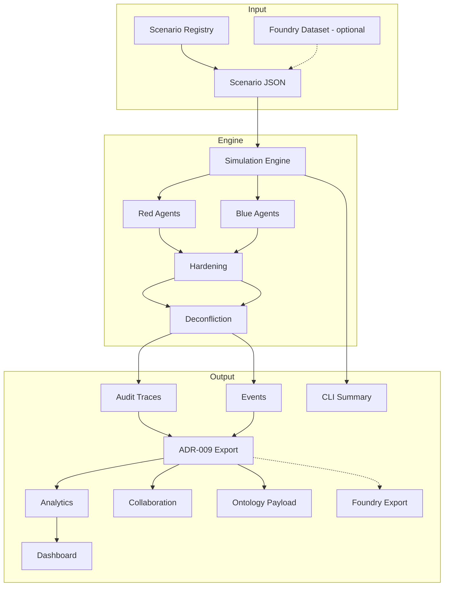

# ADSL — Capabilities Matrix

**Date:** 2026-07-08  
**Legend:** ✅ Available · 🔶 Partial / optional · ⏸ Prepared not active · ❌ Not available

---

## Simulation Core

| Capability | Status | ADR / Module | Notes |
|------------|--------|--------------|-------|
| Tick-based engine (max 100 ticks) | ✅ | ADR-004 | `SimulationEngine` default |
| Scale mode (up to 500 ticks) | ✅ | ADR-012 | `scale_mode=True` or `--scale` |
| Red-before-Blue orchestration | ✅ | ADR-004 | Deterministic turn order |
| Scenario registry (5 scenarios) | ✅ | — | `scenario_registry.json` |
| Seeded reproducible runs | ✅ | — | `--seed` CLI flag |
| Red interdiction agents | ✅ | ADR-004 | Route/node targeting |
| Blue adaptation agents | ✅ | ADR-005 | Reroute, harden, reallocate |
| Red strike pacing | ✅ | ADR-010 | Cooldown, budget, rotation |
| Hardening v2 | ✅ | ADR-008 | First attack absorption |
| Same-tick deconfliction | ✅ | ADR-008 | Suppression events |
| Mega-scale stress scenarios | ✅ | ADR-012 | `continental-grid-scale-v4`, `continental-mega-scale-v5` |

---

## Explainability & Audit

| Capability | Status | ADR / Module | Notes |
|------------|--------|--------------|-------|
| Immutable audit trace per decision | ✅ | ADR-003 | 100% agent coverage |
| Reasoning steps in traces | ✅ | ADR-003 | Policy citations |
| Structured JSON logging | ✅ | — | `structlog` events |
| Golden trace regression | ✅ | — | Hardening, deconfliction, pacing |
| Action suppression audit trail | ✅ | ADR-008 | Not silently dropped |

---

## Outputs & Analyst Tools

| Capability | Status | ADR / Module | Notes |
|------------|--------|--------------|-------|
| CLI run summary | ✅ | — | `run_simulation.py` |
| ADR-009 export bundles | ✅ | ADR-009 | JSON, JSONL, executive summary, insights |
| Automated analytics & insights | ✅ | ADR-014 | `adsl.analytics`, `analyze_run.py`, `adsl-analyze` |
| Node / route / corridor risk scoring | ✅ | ADR-014 | 0–100 scores with evidence |
| Focus area detection | ✅ | ADR-014 | Map + sidebar in dashboard |
| Bottleneck / vulnerability detection | ✅ | ADR-014 | Degree, chokepoint, Red pressure |
| Red behavior pattern analysis | ✅ | ADR-014 | Focus, rotation, pacing patterns |
| What-if run comparison | ✅ | ADR-014 | `compare_runs.py --what-if`, `adsl-compare` |
| Multi-run comparison | ✅ | — | `compare_runs.py` |
| Batch export + manifest | ✅ | ADR-012 | Sequential or `--workers N` |
| Performance benchmarks | ✅ | ADR-012 / Inc 16 | `benchmark_runs.py`, `benchmark_compare.py`, `--engine-only` |
| Runtime Red pacing overrides | ✅ | ADR-010 | Analyst spec files |
| Visualization dashboard | ✅ | Inc 14 | Risk overlay, `/api/compare`, presentation mode |
| File-based collaboration | ✅ | ADR-013 | Sessions, sharing, annotations, versioning |
| Demo playbook | ✅ | — | ~30 min workshop guide |

---

## Platform Integration

| Capability | Status | ADR / Module | Notes |
|------------|--------|--------------|-------|
| Ontology object mapping (6 types) | ✅ | ADR-006 | Offline payloads |
| Placeholder sync | ✅ | ADR-006 | Synthetic RIDs |
| Foundry dataset import | ✅ | ADR-011 | `foundry_import.py`, local + HTTP |
| Foundry results export | ✅ | ADR-011 | Traces, metrics, annotations, lineage |
| Ontology sync via HTTP | 🔶 | ADR-007/011 | Optional; REST adapter when gated |
| Live Foundry credentials | ⏸ | ADR-011 | Local mode default; live when env set |
| Schema validation script | ❌ | — | Deferred to Track B |
| Foundry Workshop app | ❌ | — | Stakeholder decision |

---

## Quality & Governance

| Capability | Status | Notes |
|------------|--------|-------|
| Parallel batch export | ✅ | `batch_export.py --workers N` (ADR-012) |
| Performance benchmarks | ✅ | `benchmark_runs.py` + baselines |
| Scale mode (500 ticks) | ✅ | Opt-in stress testing (ADR-012) |
| Scale stress scenarios | ✅ | `continental-grid-scale-v4`, `continental-mega-scale-v5` |
| Side observation cache | ✅ | Inc 16 | Dirty invalidation on applied actions |
| Engine-only benchmarks | ✅ | Inc 16 | `benchmark_runs.py --engine-only` |
| Automated test suite | ✅ | 138 tests |
| Code coverage | ✅ | ~89% overall |
| Architecture Decision Records | ✅ | ADR-001–014 |
| Increment-gated delivery | ✅ | PM directive model |
| Palantir-agnostic engine | ✅ | Zero SDK imports in simulation |

---

## Explicitly Out of Scope

| Capability | Status | Rationale |
|------------|--------|-----------|
| Doctrine modeling | ❌ | Requires scoped ADR + SME input |
| Physics / kinetic fidelity | ❌ | Phase 1/2 boundary |
| Theater-scale simulation | ❌ | Bounded logistics scope |
| LangChain / CrewAI / AutoGen | ❌ | ADR-002 prohibition |
| Classified deployment hardening | ❌ | Operations concern |
| Real-time collaborative editing | ❌ | Not in roadmap; file-based collaboration via ADR-013 |

---

## Scenario Profiles

| Scenario ID | Topology | Workshop fit | Stress profile |
|-------------|----------|--------------|----------------|
| `kessari-strait-v1` | Coastal strait | Low — fast saturation | High node destruction |
| `island-chokepoint-v2` | Island chokepoint | **High** — slow degradation | 0% node loss @100 ticks |
| `alpine-valley-v3` | Dual alpine corridor | **High** — corridor comparison | Route contestation |
| `continental-grid-scale-v4` | Grid scale fixture | Low — performance testing | Large network index |
| `continental-mega-scale-v5` | Mega-scale fixture | Low — benchmark suite | Max nodes/agents stress |

---

## Capability Flow

