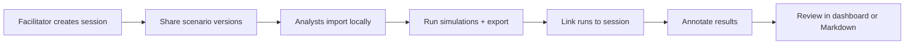

# ADSL Collaboration Workflows

**Increment 11** — File-based multi-user workshop support: sessions, scenario sharing, run linking, annotations, and version history.

---

## Overview

ADSL collaboration is **offline-first**. Teams share a session directory (network drive, git repo, or zip bundle) rather than connecting to a real-time server. This fits the ADR-009 export model and workshop playbook.

| Capability | Module | Storage |
|------------|--------|---------|
| Workshop sessions | `session.py` | `data/collaboration/sessions/{session_id}/session.json` |
| Scenario sharing | `scenario_share.py` | `shared_scenarios/*.json` |
| Version history | `versioning.py` | `scenario_history.json` |
| Run registration | `workflows.py` | `runs/{run_id}/` (copied ADR-009 exports) |
| Annotations | `annotations.py` | `annotations.json` per run export |

---

## Session Directory Layout

```
data/collaboration/sessions/{session_id}/
  session.json              # Participants, refs, activity log
  scenario_history.json     # Scenario version lineage
  shared_scenarios/           # Shareable scenario manifests
  runs/                     # Linked ADR-009 export copies
    {run_id}/
      manifest.json
      run_bundle.json
      annotations.json      # Team comments on this run
      ...
```

---

## CLI Usage

All commands use `scripts/collab_workshop.py`.

### Create and manage sessions

```bash
# Create a workshop session
python scripts/collab_workshop.py session-create "Alpine Workshop Q3" \
  --facilitator "Lead Analyst" --description "Dual-corridor comparison drill"

# List sessions
python scripts/collab_workshop.py session-list

# Show session details (use session ID or full path)
python scripts/collab_workshop.py session-show --session <session_id>

# Add participants
python scripts/collab_workshop.py participant-add --session <session_id> \
  "Blue SME" --role reviewer
```

### Share and import scenarios

```bash
# Export a registry scenario into the session
python scripts/collab_workshop.py scenario-share --session <session_id> \
  --scenario alpine-valley-v3 --label workshop-v1 --author "Lead Analyst" \
  --changelog "Baseline for workshop"

# View version history
python scripts/collab_workshop.py scenario-history --session <session_id> \
  --scenario alpine-valley-v3

# Import latest shared version locally
python scripts/collab_workshop.py scenario-import --session <session_id> \
  --scenario alpine-valley-v3 --latest
```

### Link runs and annotate results

```bash
# Export a run first (if needed)
python scripts/export_run.py --scenario alpine-valley-v3 --ticks 50 --export-dir exports

# Link export into session (copies into runs/)
python scripts/collab_workshop.py run-link --session <session_id> \
  --export-dir exports/<run_id> --author "Lead Analyst" --label "baseline"

# Add annotations
python scripts/collab_workshop.py annotate-add --session <session_id> \
  --run-id <run_id> --author "Blue SME" \
  --text "North ridge sustained contestation after tick 30" \
  --target-kind route --target-id ROUTE-NORTH-01 --tick 30

# List annotations
python scripts/collab_workshop.py annotate-list --session <session_id> \
  --run-id <run_id> --markdown
```

---

## Dashboard Integration

The visualization dashboard reads annotations from ADR-009 exports:

```bash
python scripts/launch_dashboard.py --export-dir exports
```

- **API:** `GET /api/annotations/{run_id}`
- **UI:** Team Annotations panel in the metrics sidebar

Annotations are initialized as an empty `annotations.json` on every new export (ADR-009 manifest includes the file reference).

---

## Typical Workshop Flow



1. **Facilitator** creates a session and shares the session folder.
2. **Analysts** import the latest scenario version and run simulations locally.
3. Each analyst exports runs and links them to the shared session (or facilitator collects exports).
4. Team adds annotations on nodes, routes, insights, or the run overall.
5. Review via dashboard annotations panel or `annotate-list --markdown`.

---

## Schema Versions

| Artifact | Version constant |
|----------|------------------|
| Session manifest | `COLLAB_SCHEMA_VERSION = "1.0"` |
| Annotations | `COLLAB_SCHEMA_VERSION = "1.0"` |
| Scenario share manifest | `SHARE_SCHEMA_VERSION = "1.0"` |

---

## Python API

```python
from pathlib import Path
from adsl.collaboration import (
    create_session,
    export_shared_scenario,
    register_run_export,
    annotate_run_in_session,
)

session = create_session("Workshop", facilitator="Lead")
root = Path(session["_session_root"])

export_shared_scenario(
    Path("data/synthetic/logistics_scenario_v3.json"),
    root,
    author="Lead",
    version_label="v1",
)

register_run_export(root, Path("exports/<run_id>"), author="Lead")
annotate_run_in_session(root, "<run_id>", author="SME", text="Key finding.")
```

---

## Out of Scope

- Real-time collaborative editing (see ADR-013)
- Server-side authentication or access control
- Automatic sync / conflict resolution across clients
- Foundry Workshop integration (separate stakeholder track)