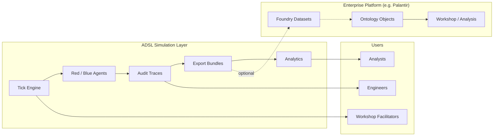

# ADSL — Positioning & Competitive Differentiation

**Audience:** Stakeholders, evaluators, integrators  
**Date:** 2026-07-08 (updated after Phase 3 Increments 6–16)

---

## Positioning Statement

**ADSL (Aether Defense Simulation Layer) is an audit-first contested-logistics simulation platform** that models Red–Blue decision-making over supply networks and produces defensible, machine-readable outputs for analysis, workshops, and optional Palantir Foundry dataset integration.

ADSL is **not** a general-purpose agent framework, a physics engine, or a replacement for Palantir Foundry. It is a **bounded, high-assurance simulation layer** that complements enterprise platforms by generating adversarial logistics scenarios with **complete reasoning traces for every agent decision**.

---

## What Makes ADSL Different

| Dimension | Typical alternatives | ADSL approach |
|-----------|---------------------|---------------|
| **Explainability** | Log side-effects or post-hoc summaries | **AuditTrace is first-class** — every agent decision produces an immutable trace with reasoning steps (ADR-003) |
| **Agent architecture** | LangChain, CrewAI, AutoGen orchestration | **Custom lightweight agents** — explicit perceive→decide→act contract; no prohibited frameworks (ADR-002) |
| **Analytics depth** | Manual spreadsheet analysis or opaque scores | **Explainable risk scoring** — node/route/corridor risk, focus areas, Red patterns, what-if comparison (ADR-014) |
| **Platform integration** | Ad-hoc exports or manual spreadsheets | **Ontology-native mapping** — six object types, ADR-009 bundles, Foundry dataset import/export (ADR-006/011) |
| **Determinism & review** | Non-reproducible or opaque conflict resolution | **Golden trace fixtures**, seeded runs, same-tick deconfliction with `ACTION_SUPPRESSED` events (ADR-008) |
| **Workshop readiness** | Author-dependent demos | **Demo playbook**, dashboard with presentation mode, file-based collaboration sessions (ADR-013) |
| **Scale practicality** | Prototypes slow on larger networks | **Observation cache + benchmarks** — mega-scale runs ~2.8× faster engine-only vs Inc 10 (Inc 16) |
| **Scope honesty** | Overclaimed “digital twin” or live integration | **Explicit boundaries** — local Foundry mode default; no doctrine/physics/theater-scale unless scoped |
| **Quality bar** | Demo-only prototypes | **138 automated tests, ~89% coverage**, regression matrix across scenarios and mechanics |

---

## Where ADSL Fits

**ADSL generates** simulation evidence and explainable analytics. **Platforms consume** structured outputs when credentials are configured. **Users** explore via CLI, exports, dashboard, or collaboration sessions.

---

## Competitive Context (Honest)

### ADSL is stronger when you need…

- Defensible audit trails for Red/Blue logistics decisions
- Repeatable workshop demos with exportable artifacts and a visual dashboard
- Automated risk scoring and what-if comparison traceable to raw simulation data
- Palantir-ready payloads and Foundry dataset paths without rewriting simulation logic
- Deterministic mechanics testing (hardening, deconfliction, Red pacing)
- Practical performance on larger multi-agent scenarios (up to documented soft limits)
- File-based team collaboration for workshop annotation and scenario sharing
- A small, reviewable Python codebase with ADR-governed design

### ADSL is not the right tool when you need…

- Theater-wide force-on-force modeling with doctrine fidelity
- Physics-based or high-fidelity kinetic simulation
- Live Foundry integration **today** without configuring credentials and env gates
- LLM-driven autonomous agents with open-ended tool use
- Real-time collaborative scenario editing across multiple users
- Geospatial 3D visualization or operational map tiles
- Real-time streaming simulation or distributed cluster execution

---

## Strategic Message

> ADSL trades breadth for **auditability, explainable analytics, modularity, and workshop usability**. It demonstrates that contested-logistics simulation can be delivered with full traceability, strong test discipline, practical scale performance, and honest platform-integration boundaries — preparing for Palantir activation without overclaiming it.

---

## Related Reading

- [what-is-adsl.md](what-is-adsl.md) — core value and audience
- [capabilities-and-limitations.md](capabilities-and-limitations.md) — honest current state
- [scale-performance.md](scale-performance.md) — benchmarks and scaling guidance
- [capabilities-matrix.md](capabilities-matrix.md) — feature availability reference